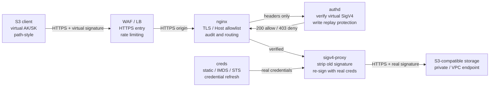

# s3-l7-gateway

[简体中文](README.md) | English · [Documentation site](https://scott987-cmd.github.io/s3-l7-gateway/)

> **⚠️ This is an independent third-party open-source project.** It is developed and maintained by an individual. It is **not an official product, reference architecture or supported offering of any cloud provider, object storage vendor or SaaS vendor**, and it is not authorised, certified or endorsed by any of them. Product names and trademarks belong to their respective owners and appear only to describe compatibility and configuration formats.

A layer-7 S3 gateway that lets external callers reach your private object storage with a **standard S3 SDK** while never holding the **real** AK/SK.

Callers get a **virtual AK/SK** issued by the gateway and sign normally with SigV4. The gateway verifies that signature, strips it, and re-signs the request with real upstream credentials that exist only inside the gateway runtime. Client code does not change — only the endpoint, region and credentials do.



## The problem it solves

In one sentence: **the object storage cannot be exposed to the internet, the real AK/SK cannot be handed to callers, and the applications still need to speak standard S3.**

| Capability | Why it matters |
|---|---|
| **Real credential isolation** | Clients never obtain the real AK/SK; those exist only in the `creds` and `sigv4-proxy` runtime |
| **A key per caller** | One virtual AK/SK per application or tenant, with owner, note and expiry |
| **Seconds-level revocation** | `keyctl.sh disable <AK> --reload` kills one caller without touching the others or rotating real credentials |
| **Caller-level audit** | Method, object path, status, upstream status and latency attributed to a virtual AK; full query string not recorded |
| **No client rewrite** | Still aws-cli / boto3 / any standard S3 SDK — only endpoint, region and credentials change |
| **One-command acceptance** | `acceptance.sh` chains configure, preflight, deploy, health and smoke test |

## Quick start

```bash
sudo bash scripts/init_host.sh          # installs Docker, Compose, aws-cli; re-runnable

export S3_ACCESS_KEY=<real-upstream-ak> # keep real credentials out of shell history
export S3_SECRET_KEY=<real-upstream-sk>

./scripts/acceptance.sh \
  S3_REGION=<region> \
  S3_ENDPOINT_HOST=<private-s3-endpoint-host> \
  S3_BUCKET_HOST=<bucket>.<private-s3-endpoint-host> \
  S3_CREDS_SOURCE=static \
  TEST_BUCKET=<bucket> \
  GW_BIND_ADDR=0.0.0.0 \
  GW_LISTEN_PORT=443 \
  GW_SERVER_NAMES="s3gw.example.com" \
  HEALTH_ALLOW_DIRECTIVES="allow <waf-cidr>; allow <lb-health-cidr>; allow 127.0.0.1; deny all;" \
  SIGV4_PROXY_MEM_LIMIT=4g
```

A successful run ends with:

```text
configure passed
preflight PASS=21 WARN=0 FAIL=0
deploy passed
health passed
smoke PASS=5 WARN=1 FAIL=0
acceptance passed
```

That smoke `WARN` is normally the real upstream credential lacking `DeleteObject` — which is the least-privilege design working. Set `TEST_REQUIRE_DELETE=1` when delete capability is contractually required.

## Client integration

```python
import boto3
from botocore.config import Config

s3 = boto3.client(
    "s3",
    endpoint_url="https://s3gw.example.com",          # the gateway
    aws_access_key_id="<virtual-ak>",
    aws_secret_access_key="<virtual-sk>",
    region_name="<region>",
    config=Config(s3={"addressing_style": "path"}),   # path-style is required
)
s3.put_object(Bucket="<bucket>", Key="reports/a.txt", Body=b"hello")
```

## Virtual key lifecycle

```bash
./scripts/keyctl.sh add --owner team-a --note "production client" \
  --expires 2027-12-31T23:59:59Z --reload
./scripts/keyctl.sh list
./scripts/keyctl.sh disable AKxxxxx --note "suspected leak" --reload
```

Prefer `disable` over deletion — it keeps the entry and the audit trail. Changes append to `auth/keys_audit.log`.

## The four services

Only `nginx` maps a host port. Every service runs with a read-only root filesystem, `cap_drop: ALL` and `no-new-privileges`.

| Service | Responsibility | Boundary |
|---|---|---|
| `nginx` | TLS, Host narrowing, health checks, rate limiting, audit, path-style routing | Non-root UID 101; unknown Host closes the connection |
| `authd` | Rebuild the canonical request and verify the client's virtual SigV4; write replay protection | scratch image; dynamic SignedHeaders; 300 s clock window by default |
| `creds` | Obtain real upstream credentials via static / IMDS / STS and serve them locally | Real credentials never reach the client; written to tmpfs |
| `sigv4-proxy` | Strip the client signature and re-sign for the fixed upstream bucket host | 4 GiB memory limit by default; upstream always HTTPS |

## L4 or L7

The same "expose private object storage" problem has two answers. The full comparison, with measured numbers, is on the [documentation site](https://scott987-cmd.github.io/s3-l7-gateway/#compare).

**Choose this gateway** when any of these is true: callers sit outside your trust boundary and must not hold real credentials; you need per-application issuance, expiry and revocation; you need to know which caller touched which object; you need to cut one caller off in seconds rather than rotating everyone.

**Choose [L4 passthrough](https://github.com/scott987-cmd/s3-l4-proxy)** when none of them is: callers are already inside the trust boundary, credential distribution is not a problem, and what you want is maximum throughput, minimum operations and the broadest vendor compatibility.

The cost is real and measured. On a controlled intranet test with a fixed 256-byte response at concurrency 4: L4 passthrough 11,693 QPS at 0.34 ms, this gateway 3,951 QPS at 0.97 ms — roughly **one third of the small-object QPS**, bought with credential isolation, caller attribution, single-key revocation and an unchanged client.

## Verified, and where it breaks

From-zero delivery on a freshly reinstalled CentOS Stream 9 ECS with no Docker, Compose or aws-cli present:

| Check | Result |
|---|---|
| Preflight | `PASS=21 WARN=0 FAIL=0` |
| Smoke | `PASS=5 WARN=1 FAIL=0` (warning: no `DeleteObject`) |
| Quick throughput | 8 MiB PUT / GET with MD5 match |
| Public health probe | 403 after hardening, matching the source allowlist |
| Unknown Host | Connection closed by the nginx default server |

Capacity on 2 vCPU / 7.4 GiB — including the failure boundary:

| Scenario | Result |
|---|---|
| 64 MiB object, concurrency 32 | Succeeded |
| 256 MiB object, concurrency 4 / 8 | Succeeded |
| 256 MiB object, concurrency 16 | `sigv4-proxy` OOM |

`SIGV4_PROXY_MEM_LIMIT=4g` bounds the blast radius but does not remove the large-object memory characteristic. **Re-test at your own object sizes, concurrency and host size before production.**

## Not supported today

- **Presigned URLs.** Header-based SigV4 only; query-only `X-Amz-*` authentication is not accepted.
- **Multiple buckets per instance.** One `S3_BUCKET_HOST` per instance; separate buckets or trust boundaries need separate instances.
- **Cross-instance replay protection.** The write replay cache is per-process; strict global once-only semantics need a shared cache or sticky load balancing.

## Documentation

- [Deployment and operations manual (Chinese)](docs/USER_GUIDE.zh-CN.md) — fifteen chapters: architecture, deployment, integration, WAF, security model, load testing, operations, troubleshooting, go-live checklist
- [Detailed reference (Chinese)](docs/REFERENCE.zh-CN.md) — layout, design notes, `authd` verification internals, hardening checklist, bucket policy appendix
- [Deployment](docs/deployment.md) · [Operations](docs/operations.md) · [Security and WAF](docs/security-waf.md) · [Testing](docs/testing.md)
- [Security policy](SECURITY.md) · [Contributing](CONTRIBUTING.md) · [Changelog](CHANGELOG.md)

## Disclaimer

Provided "AS IS" without warranty of any kind. The performance and verification figures come from controlled tests in one environment and are **not a performance commitment or SLA**; capacity conclusions must come from load testing in your own environment. The deployment scripts install software, start containers and modify host configuration — rehearse outside production first. Security and compliance assessment remains yours.

Full terms in [DISCLAIMER.md](DISCLAIMER.md).

## License

[Apache-2.0](LICENSE)
