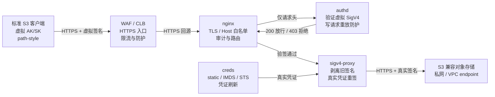

# s3-l7-gateway

简体中文 | [English](README.en.md) · [在线文档](https://scott987-cmd.github.io/s3-l7-gateway/)

> **⚠️ 这是第三方独立开源项目。** 本项目由个人开发者独立开发与维护，**不是任何云服务商、对象存储厂商或 SaaS 厂商的官方产品、官方方案或官方支持内容**，也未获得上述任何一方的授权、认证或背书。文中出现的产品名称与商标归各自所有者所有，仅用于说明兼容性与配置格式。

七层 S3 安全网关：让外部调用方用**标准 S3 SDK** 访问你的私有对象存储，但**永远拿不到真实 AK/SK**。

调用方持有网关签发的**虚拟 AK/SK**，用它生成标准 SigV4 签名；网关验签通过后，剥离旧签名，用只存在于网关运行态的**真实上游凭证重新签名**，再访问私网对象存储。客户端代码不需要改造——只改 endpoint、region 和凭证三项。



## 它解决什么问题

一句话：**对象存储不能直接暴露公网，真实 AK/SK 不能分发给调用方，但业务系统需要标准 S3 协议接入。**

| 能力 | 价值 |
|---|---|
| **真实凭证隔离** | 客户端永远拿不到真实 AK/SK；真实凭证只存在于 `creds` 与 `sigv4-proxy` 的运行态 |
| **按调用方发密钥** | 每个应用/租户一把虚拟 AK/SK，可独立设置归属、备注、到期 |
| **秒级吊销** | `keyctl.sh disable <AK> --reload` 单把失效，不影响其他调用方，不需要轮换真实凭证 |
| **调用方级审计** | 按虚拟 AK 记录方法、对象路径、状态、上游状态和耗时；不记录完整 query |
| **客户端零改造** | 仍用 aws-cli / boto3 / 任意标准 S3 SDK，只改 endpoint、region、凭证 |
| **一键部署验收** | `acceptance.sh` 串起配置、预检、部署、健康检查和冒烟测试 |

## 快速开始

```bash
# 1) 新主机初始化（安装 Docker / Compose / aws-cli，可重复执行）
sudo bash scripts/init_host.sh

# 2) 真实凭证走环境变量，不进 shell history
export S3_ACCESS_KEY=<real-upstream-ak>
export S3_SECRET_KEY=<real-upstream-sk>

# 3) 一条命令完成配置、预检、部署、健康检查和冒烟
./scripts/acceptance.sh \
  S3_REGION=<region> \
  S3_ENDPOINT_HOST=<private-s3-endpoint-host> \
  S3_BUCKET_HOST=<bucket>.<private-s3-endpoint-host> \
  S3_CREDS_SOURCE=static \
  TEST_BUCKET=<bucket> \
  GW_BIND_ADDR=0.0.0.0 \
  GW_LISTEN_PORT=443 \
  GW_SERVER_NAMES="s3gw.example.com" \
  HEALTH_ALLOW_DIRECTIVES="allow <waf-cidr>; allow <lb-health-cidr>; allow 127.0.0.1; deny all;" \
  SIGV4_PROXY_MEM_LIMIT=4g
```

验收成功的样子：

```text
configure passed
preflight PASS=21 WARN=0 FAIL=0
deploy passed
health passed
smoke PASS=5 WARN=1 FAIL=0
acceptance passed
```

`smoke` 的那个 WARN 通常是真实上游凭证没有 `DeleteObject` 权限——符合最小权限设计。客户要求必须能删时设 `TEST_REQUIRE_DELETE=1`。

## 客户端怎么接

```python
import boto3
from botocore.config import Config

s3 = boto3.client(
    "s3",
    endpoint_url="https://s3gw.example.com",   # 改成网关地址
    aws_access_key_id="<virtual-ak>",           # 虚拟 AK
    aws_secret_access_key="<virtual-sk>",       # 虚拟 SK
    region_name="<region>",
    config=Config(s3={"addressing_style": "path"}),  # 必须 path-style
)
s3.put_object(Bucket="<bucket>", Key="reports/a.txt", Body=b"hello")
```

## 虚拟密钥生命周期

```bash
# 签发（一应用一把，带归属、备注、到期）
./scripts/keyctl.sh add --owner team-a --note "production client" \
  --expires 2027-12-31T23:59:59Z --reload

./scripts/keyctl.sh list                       # 查看 ACTIVE / DISABLED / EXPIRED

# 泄露时秒级吊销，不影响其他调用方
./scripts/keyctl.sh disable AKxxxxx --note "suspected leak" --reload
```

优先 `disable` 而非删除——保留密钥条目和审计记录。变更会追加到 `auth/keys_audit.log`。

## 四个服务

只有 `nginx` 对外映射宿主端口。全部服务只读根文件系统、`cap_drop: ALL`、`no-new-privileges`。

| 服务 | 职责 | 安全边界 |
|---|---|---|
| `nginx` | TLS、Host 收敛、健康检查、限流、审计、path-style 路由 | 非 root UID 101；未知 Host 关闭连接 |
| `authd` | 重建 canonical request，验证客户端虚拟 SigV4，写请求重放防护 | scratch 镜像；动态 SignedHeaders；默认 300 秒时钟窗口 |
| `creds` | 按 static / IMDS / STS 获取真实上游凭证并提供本机凭证端点 | 真实凭证不下发客户端；凭证写入 tmpfs |
| `sigv4-proxy` | 清除客户端旧签名，用真实凭证对固定上游 bucket host 重签 | 默认 4 GiB 内存上限；上游始终 HTTPS |

## 四层还是七层

同一个「私有对象存储对外接入」问题有两种解法，取舍点很清晰。完整对比（含实测数据）见[在线文档](https://scott987-cmd.github.io/s3-l7-gateway/#compare)。

**选七层网关**，当你需要其中任意一条：

- 调用方在信任边界之外，不能持有真实 AK/SK
- 多租户/多应用，需要按调用方独立签发、吊销、设到期
- 需要知道「哪个调用方在什么时候读写了哪个对象」
- 出了事要能秒级切断某一方，而不是轮换所有人的凭证

**选[四层透传](https://github.com/scott987-cmd/s3-l4-proxy)**，当以上都不需要：调用方本来就在可信侧、凭证分发不是问题，而你要的是最高吞吐、最低运维和最广的厂商兼容性。

代价是诚实的：受控测试中（256 字节固定响应、并发 4），四层透传 11,693 QPS / 0.34 ms，完整网关 3,951 QPS / 0.97 ms——**约 1/3 的小对象 QPS**，换来凭证隔离、调用方审计、单把吊销和客户端零改造。

## 已验证与容量边界

在重装后的 CentOS Stream 9 ECS 上从零完成交付验证（初始无 Docker / Compose / aws-cli）：

| 验证项 | 结果 |
|---|---|
| 预检 | `PASS=21 WARN=0 FAIL=0` |
| 冒烟 | `PASS=5 WARN=1 FAIL=0`（WARN 来自 DeleteObject 权限不足） |
| 快速吞吐 | 8 MiB PUT / GET / MD5 校验通过 |
| 公网健康检查 | 加固后返回 403，符合来源白名单预期 |
| 未知 Host | 由 nginx 默认 server 关闭连接 |

容量边界（2 vCPU / 7.4 GiB ECS）：

| 场景 | 结果 |
|---|---|
| 64 MiB 对象，并发 32 | 成功 |
| 256 MiB 对象，并发 4 / 8 | 成功 |
| 256 MiB 对象，并发 16 | `sigv4-proxy` OOM |

> **关于以上容量数字的一个说明。** 这些数据由 `stress_test.sh` 在一处已修复的缺陷之前跑出：当时同一并发批次内的所有 worker 因变量展开时机问题落到了**同一个 object key** 上，而不是各自独立的对象。并发数与对象大小是真实的，`sigv4-proxy` 在 256 MiB × 16 下触发 OOM 的结论也仍然成立（内存压力来自并发大对象流本身）；但吞吐类数字建议用修复后的工具在你自己的环境重新测量。

`SIGV4_PROXY_MEM_LIMIT=4g` 限制单容器故障半径，但没有消除大对象高并发的内存特征。**生产参数必须以你自己的对象大小、并发和主机规格重新压测。**

## 当前不支持

- **预签名 URL**：客户端必须使用请求头 `Authorization` 的标准 SigV4，不支持只靠 `X-Amz-*` query 参数认证。
- **一实例多 bucket**：每个实例绑定一个 `S3_BUCKET_HOST`；多桶或不同权限边界请部署独立实例。
- **跨实例重放防护**：写请求重放缓存是进程内状态，多实例不共享；严格全局一次性语义需要共享缓存或负载均衡粘滞。

## 文档

- [对接阿里云 OSS](docs/aliyun-oss.zh-CN.md) — 实测通过的配置、两个反直觉结论（region 不校验 / service 必须是 s3）、Anolis 装 Docker 的坑
- [部署与运维手册](docs/USER_GUIDE.zh-CN.md) — 十五章完整手册：架构、部署、接入、WAF、安全体系、压测、运维、排障、上线清单
- [详细参考](docs/REFERENCE.zh-CN.md) — 目录结构、设计说明、authd 验签细节、生产加固清单、桶策略附录
- [部署](docs/deployment.md) · [运维](docs/operations.md) · [安全与 WAF](docs/security-waf.md) · [测试](docs/testing.md)
- [安全策略](SECURITY.md) · [贡献指南](CONTRIBUTING.md) · [更新日志](CHANGELOG.md)

## 免责声明

本项目按「现状」提供，不附带任何明示或默示担保。文档中的性能与验证结果来自特定环境的受控测试，**不构成性能承诺或 SLA**，容量结论须以你自己环境的压测为准。部署脚本会安装软件、启动容器并修改主机配置——请先在非生产环境演练。安全与合规责任由使用者自行承担。

完整条款见 [DISCLAIMER.md](DISCLAIMER.md)。

## 许可

[Apache-2.0](LICENSE)
