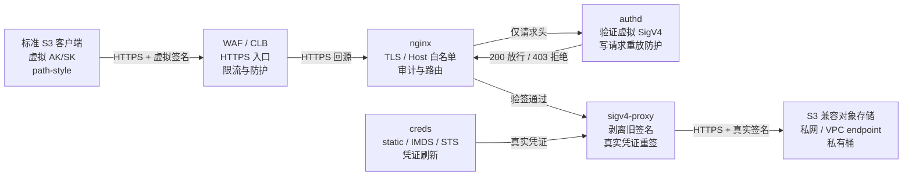
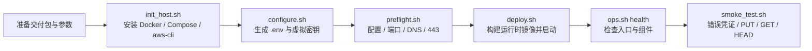
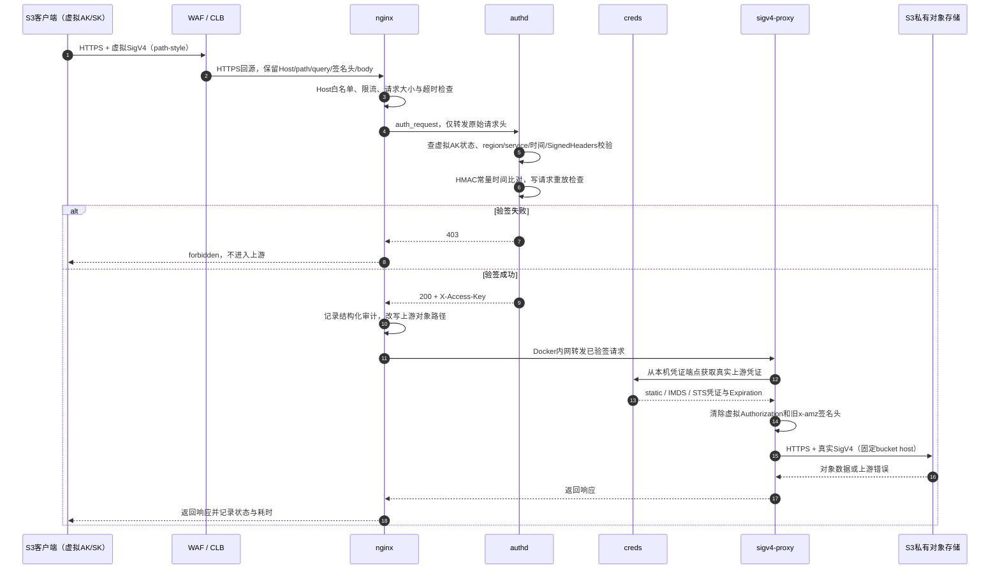

# S3 兼容对象存储七层安全网关 — 部署与运维手册

本文面向实施、运维、安全和应用接入人员，与仓库中的代码实现保持一致，只描述当前有效能力。

| **适用范围** | 支持标准 S3 SigV4 的对象存储；默认使用通用静态 S3 凭证，也可按供应商能力使用 IMDS/STS |
|---|---|
| **推荐部署** | WAF/CLB 前置、网关监听 HTTPS 443、对象存储使用私网或 VPC endpoint |

> **用户只需要记住一件事：**应用仍然使用标准 S3 SDK，只把 endpoint 改为网关地址，并使用网关签发的虚拟 AK/SK。真实对象存储凭证只存在于网关运行态，不下发给应用。

## 一、方案概览

该网关用于解决“对象存储不能直接暴露公网、真实 AK/SK 不能分发给调用方、但业务系统需要标准 S3 协议接入”的问题。客户端使用虚拟 AK/SK 生成标准 SigV4 签名；网关验证签名后，再用真实上游凭证重新签名并访问私有对象存储。

### 1.1 你将获得什么

| 能力 | 用户价值 |
|---|---|
| **标准 S3 接入** | 兼容 aws-cli、boto3 和其他标准 S3 SDK；业务代码通常只需修改 endpoint、region 和凭证。 |
| **真实凭证隔离** | 客户端永远拿不到真实对象存储 AK/SK；真实凭证由 `creds` 边车供给重签代理。 |
| **按应用分配密钥** | 每个应用或租户可使用独立虚拟 AK/SK，支持单独禁用、到期和审计。 |
| **一键部署验收** | `acceptance.sh` 串行完成参数配置、预检、部署、健康检查和冒烟测试。 |
| **安全暴露** | 内置 Host 白名单、健康检查来源限制、TLS 加固、只读容器、最小权限和审计日志。 |
| **长期运维** | 提供健康、状态、日志、审计、密钥热加载、支持包、吞吐测试和阶梯压测工具。 |

### 1.2 当前支持边界

主链路是通用 S3 SigV4，不要求上游必须是 TOS。通用对象存储建议使用 `S3_CREDS_SOURCE=static`；Volcengine 环境可选用已实现的 IMDS 或 STS 获取方式。

- 每个网关实例配置一个固定的 `S3_BUCKET_HOST`，需要隔离多个上游桶时建议按桶或安全边界拆分实例。
- 客户端使用请求头中的 `Authorization` 完成 SigV4 认证；当前不支持只通过 `X-Amz-*` query 参数认证的预签名 URL。
- 客户端对网关使用 path-style：`https://gateway/<bucket>/<key>`；网关回源时使用配置好的 virtual-hosted bucket host。
- 写操作默认启用单进程重放防护；多实例部署需要额外评估共享重放状态或负载均衡粘滞策略。
## 二、系统架构



当前部署由四个服务组成。只有 nginx 对外提供 HTTPS 入口；`authd`、`creds` 和 `sigv4-proxy` 不映射宿主端口。所有服务使用只读根文件系统、移除 Linux capabilities，并开启 `no-new-privileges`。

| 组件 | 职责 | 安全边界 |
|---|---|---|
| `nginx` | TLS、Host 收敛、健康检查、限流、审计和流量转发。 | 非 root UID 101；未知 Host 关闭连接；只接受配置的业务域名。 |
| `authd` | 读取虚拟密钥库，重建 canonical request 并验证客户端 SigV4。 | scratch 镜像；动态 SignedHeaders；默认 300 秒时钟窗口。 |
| `creds` | 从 static、IMDS 或 STS 获取真实上游凭证并提供本地凭证端点。 | 真实凭证不下发客户端；服务只在共享网络命名空间中可见。 |
| `sigv4-proxy` | 清除客户端旧签名，使用真实凭证向固定上游 bucket host 重新签名。 | 默认 4 GiB 内存限制；上游始终使用 HTTPS。 |

## 三、部署前准备

### 3.1 主机要求

| 项目 | 要求 |
|---|---|
| 操作系统 | 已验证 CentOS Stream 9；初始化脚本面向 CentOS/RHEL el9 系列。 |
| 权限 | 首次安装 Docker/Compose/aws-cli 需要 root 或 sudo；日常运行需要访问 Docker daemon。 |
| 网络 | 可访问上游 S3 endpoint 的 TCP 443；推荐使用私网或 VPC endpoint。 |
| 入口端口 | 本地验证默认 8443；WAF/CLB 后端推荐 HTTPS 443。 |
| 资源 | 按对象大小和并发规划内存；`sigv4-proxy` 默认限制 4 GiB。 |
| 时间同步 | 客户端和网关都必须启用 NTP；默认允许的 SigV4 时钟偏差为 300 秒。 |

### 3.2 必备信息

| 参数 | 填写说明 |
|---|---|
| `S3_REGION` | 上游要求的 SigV4 region，例如 `cn-beijing` 或 `us-east-1`。 |
| `S3_ENDPOINT_HOST` | 上游 region 级 endpoint，不带协议；优先填写私网/VPC endpoint。 |
| `S3_BUCKET_HOST` | 固定上游桶域名，通常是 `<bucket>.<s3-endpoint-host>`。 |
| `TEST_BUCKET` | 冒烟、吞吐和压测使用的 bucket 名。 |
| `S3_ACCESS_KEY` / `S3_SECRET_KEY` | 上游真实凭证；只通过环境变量或受控配置传入，不发送给客户端。 |
| `GW_SERVER_NAMES` | nginx 接受的业务 Host；生产必须包含 WAF/CLB 转发的客户端网关域名。 |
| `HEALTH_ALLOW_DIRECTIVES` | `/healthz` 的来源白名单，填写 WAF/CLB 健康检查 CIDR 和必要运维网段。 |

### 3.3 真实凭证来源

| 模式 | 适用环境 | 说明 |
|---|---|---|
| `static` | 通用 S3、物理机、VMware | 默认模式；使用 `S3_ACCESS_KEY` 和 `S3_SECRET_KEY`。 |
| `imds` | 支持当前实现兼容元数据服务的 Volcengine ECS | 从实例角色获取临时凭证，避免在主机配置长期凭证。 |
| `sts` | Volcengine STS AssumeRole | 使用长期凭证换取临时凭证并自动刷新。 |
| `auto` | Volcengine 混合环境 | 按 IMDS、STS、static 顺序回退；非 Volcengine 环境不建议使用。 |

## 四、一键部署与验收



### 4.1 新主机初始化

客户交付包已包含 Linux amd64 的 `authd`、`creds` 运行时二进制和 CA bundle，目标主机不需要安装 Go，也不需要现场拉取 Go builder 镜像。

```bash
cd s3gw
sudo bash scripts/init_host.sh
```

初始化脚本会安装并启动 Docker Engine、Compose 插件和 aws-cli，可重复执行。

### 4.2 一条命令完成配置、部署和验收

真实 AK/SK 建议通过环境变量传入，避免进入 shell history。下面示例使用通用 S3 静态凭证，并把网关部署为 WAF/CLB 的 HTTPS 443 后端。

```bash
export S3_ACCESS_KEY=<real-upstream-ak>
export S3_SECRET_KEY=<real-upstream-sk>

./scripts/acceptance.sh \
  S3_REGION=<region> \
  S3_ENDPOINT_HOST=<private-s3-endpoint-host> \
  S3_BUCKET_HOST=<bucket>.<private-s3-endpoint-host> \
  S3_CREDS_SOURCE=static \
  TEST_BUCKET=<bucket> \
  GW_BIND_ADDR=0.0.0.0 \
  GW_LISTEN_PORT=443 \
  GW_SERVER_NAMES="s3gw.example.com" \
  HEALTH_ALLOW_DIRECTIVES="allow <waf-cidr>; allow <clb-health-cidr>; allow 127.0.0.1; deny all;" \
  SIGV4_PROXY_MEM_LIMIT=4g \
  TEST_REQUIRE_DELETE=0
```

`acceptance.sh` 会自动调用 `configure.sh`、`preflight.sh`、`deploy.sh`、`ops.sh health` 和 `smoke_test.sh`。首次运行还会生成客户端虚拟 AK/SK，并写入权限为 0600 的 `.env` 和 `auth/keys.json`。

### 4.3 如何判断验收成功

```text
configure passed
preflight PASS=21 WARN=0 FAIL=0
deploy passed
health passed
smoke PASS=5 WARN=1 FAIL=0
acceptance passed
```

当真实上游凭证没有 `DeleteObject` 权限时，删除步骤会显示 WARN，但 PUT、GET、HEAD 和内容一致性全部通过即可完成基础验收。如果客户要求必须具备删除能力，设置 `TEST_REQUIRE_DELETE=1`。

### 4.4 只做部署前检查

```bash
./scripts/preflight.sh

# 已部署实例再次检查时允许端口已占用
ALLOW_PORT_IN_USE=1 ./scripts/preflight.sh
```

预检会检查关键配置、Docker/Compose、curl、openssl、jq、aws-cli、Docker daemon、上游 endpoint DNS、TCP 443、宿主监听端口和 compose 配置渲染。预检不会输出 AK/SK 明文。

## 五、客户端接入

### 5.1 客户端配置

客户端使用标准 S3 协议和网关签发的虚拟 AK/SK。不要把真实上游凭证下发到客户端。客户端必须使用 path-style，并把 region 设置为网关的 `S3_REGION`。

```python
import boto3
from botocore.config import Config

s3 = boto3.client(
    "s3",
    endpoint_url="https://s3gw.example.com",
    aws_access_key_id="<virtual-ak>",
    aws_secret_access_key="<virtual-sk>",
    region_name="<region>",
    config=Config(s3={"addressing_style": "path"}),
)

s3.put_object(Bucket="<bucket>", Key="reports/a.txt", Body=b"hello")
body = s3.get_object(Bucket="<bucket>", Key="reports/a.txt")["Body"].read()
```

```bash
export AWS_ACCESS_KEY_ID=<virtual-ak>
export AWS_SECRET_ACCESS_KEY=<virtual-sk>
export AWS_DEFAULT_REGION=<region>
export AWS_S3_ADDRESSING_STYLE=path

aws --endpoint-url https://s3gw.example.com \
  s3api head-object \
  --bucket <bucket> \
  --key reports/a.txt
```

生产证书必须由客户端信任的 CA 签发。`verify=False`、`-k` 和 `--no-verify-ssl` 只允许用于部署前的受控测试。

### 5.2 域名与证书

客户端签名中的 HTTP Host 是 SigV4 的一部分。外网访问域名和 WAF 的内网回源地址可以不同，但 WAF 回源 HTTP Host 必须保持为客户端签名使用的业务域名。

| 配置 | 示例 | 要求 |
|---|---|---|
| 客户端访问域名 | `s3gw.example.com` | 客户端 endpoint；其 Host 参与 SigV4。 |
| WAF 回源地址 | `origin-s3gw.example.internal` | 只用于定位后端，可以与公网域名不同。 |
| WAF 回源 HTTP Host | `s3gw.example.com` | 必须保持客户端签名时的 Host。 |
| WAF 回源 TLS SNI | `origin-s3gw.example.internal` | 必须被网关回源证书 SAN 覆盖。 |

### 5.3 虚拟密钥管理

建议每个应用或租户使用独立虚拟 AK/SK，并设置归属、备注和到期时间。密钥只在创建时显示完整 SK，应立即存入客户的秘密管理系统。

```bash
# 创建并立即热加载
./scripts/keyctl.sh add \
  --owner team-a \
  --note "production client" \
  --expires 2027-12-31T23:59:59Z \
  --reload

# 查看状态
./scripts/keyctl.sh list

# 泄露时秒级禁用并热加载
./scripts/keyctl.sh disable AKxxxxx \
  --note "suspected leak" \
  --reload
```

优先使用 `disable` 而不是直接删除，它会保留密钥条目和审计记录。密钥变更会追加到 `auth/keys_audit.log`。

## 六、WAF、CLB 与网络安全

> **推荐模式：**客户端到 WAF 使用 HTTPS，WAF 终止 TLS 并执行 L7 检测，WAF/CLB 到网关仍使用 HTTPS 443，并校验网关回源证书。TLS 卸载本身不会破坏 SigV4。

### 6.1 WAF 必须保持什么

真正会破坏 SigV4 的不是 TLS 卸载，而是 WAF 或负载均衡改变了客户端签名覆盖的 HTTP 语义。

- 保留 HTTP method 和客户端签名时的 `Host`。
- 不规范化、解码后重编码或合并对象 key 路径。
- 不删除、重排或改写 query 参数。
- 不删除或改写 `Authorization`、`x-amz-date`、`x-amz-content-sha256`、`x-amz-security-token` 和其他 `SignedHeaders`。
- 不解压、重压缩、转码或修改请求体和响应体。
### 6.2 WAF 配置建议

| 项目 | 建议 |
|---|---|
| 允许方法 | 允许 GET、HEAD、PUT、POST、DELETE；浏览器跨域场景按需允许 OPTIONS。 |
| 大对象上传 | 配置流式转发或受控 body inspection bypass；避免完整缓冲对象后再回源。 |
| 超时 | WAF/CLB idle timeout 与上传超时不小于网关 300 秒，或按最大对象和最低带宽重新计算。 |
| 托管规则 | 阻断明显非 S3 扫描，但对合法对象 key 做规则排除，避免特殊字符被误判。 |
| 缓存 | 禁止缓存 S3 写请求和私有对象响应，禁止自动压缩、图片处理和内容替换。 |
| 日志 | 脱敏 `Authorization`、`x-amz-security-token`、AK/SK 和完整认证参数。 |

### 6.3 网络与健康检查

- ECS 安全组入站 443 只允许 WAF/CLB 出口 CIDR 和必要的运维网段。
- 后端 ECS 443 不应长期直接暴露公网。
- CLB 健康检查 Host 必须命中 `GW_SERVER_NAMES`。
- CLB 健康检查来源 CIDR 必须加入 `HEALTH_ALLOW_DIRECTIVES`。
- 公网直接访问 `/healthz` 返回 403 是安全预期；CLB 健康源应得到 200。
未知 Host 会进入 nginx 默认 server 并关闭连接。上线前应只在 `GW_SERVER_NAMES` 中保留正式业务域名和必要的内部健康检查域名，不要永久加入原始 ECS 公网 IP。

## 七、整体安全防护体系

> **安全设计结论：**本方案不是依赖单一鉴权点，而是把网络入口、TLS、虚拟凭证验签、真实凭证隔离、出站重签、容器最小权限、审计与应急吊销组合成纵深防御。任一单层出现配置错误时，后续层仍应继续限制攻击影响。

### 7.1 安全目标与信任边界

方案保护的核心资产是私有对象数据、真实上游 AK/SK 和不同调用方之间的访问边界。客户端属于外部调用方信任区，只持有虚拟 AK/SK；WAF、CLB 和网关主机属于受控接入区；真实凭证只存在于 `creds` 与 `sigv4-proxy` 的运行态；上游对象存储是最终受保护资源。

| 信任区 | 持有的信息 | 允许的行为 |
|---|---|---|
| **客户端区** | 虚拟 AK/SK、网关 endpoint、region | 生成标准 S3 SigV4 请求；不能获取真实凭证，也不能绕过网关治理。 |
| **入口防护区** | WAF 公网证书、回源配置、来源策略 | 终止 TLS、执行 L7 防护并以 HTTPS 回源；不得改写已签 HTTP 语义。 |
| **网关运行区** | 虚拟密钥库、真实凭证运行态、审计日志 | 验虚拟签名、记录调用方身份、剥离旧签名并使用真实凭证重签。 |
| **对象存储区** | 私有桶与对象数据 | 只接受真实上游凭证签名且符合桶权限策略的请求。 |

跨信任边界传递的是签名证明，而不是密钥本身。虚拟 SK 和真实 SK 都只在各自受控环境中参与本地 HMAC 计算，不作为请求参数在网络中传输。

### 7.2 应用安全交互全过程

应用安全交互流程如下。当前链路包含 WAF/CLB HTTPS 回源、独立 `creds` 凭证边车、动态 SignedHeaders、写请求重放防护和出站旧签名清理。



**客户端签名。**客户端使用虚拟 SK 对 path-style 请求生成标准 SigV4。网络中传输的是 `Authorization` 签名结果，虚拟 SK 本身不离开客户端。

**WAF 与 TLS。**WAF 可以终止客户端 TLS，但必须用 HTTPS 回源，并保持客户端签名时的 Host、method、path、query、签名头和请求体语义。TLS 卸载本身不影响 SigV4，报文改写才会造成签名失败或完整性风险。

**入站验签。**nginx 使用 `auth_request` 把原始请求头发送给 `authd`，不传请求体。`authd` 检查虚拟 AK 是否存在、启用且未过期，验证 credential scope、300 秒时钟窗口、动态 SignedHeaders、Host 必签和 HMAC 签名。PUT、POST、DELETE、PATCH 默认启用一次性写请求重放检查。

**身份归因。**验签成功后，`authd` 通过 `X-Access-Key` 把调用方虚拟 AK 返回给 nginx。nginx 在审计日志中记录 access key、方法、URI、状态、上游状态和耗时，但不记录完整 query。

**出站重签。**`sigv4-proxy` 从 `creds` 的本机凭证端点获取真实凭证，清除客户端的虚拟 `Authorization`、安全令牌、日期、payload hash 和 SDK checksum/trailer 头，然后对固定 `S3_BUCKET_HOST` 生成新的真实 SigV4，并通过 HTTPS 访问上游对象存储。

**双重授权。**请求必须先通过虚拟凭证验签，随后还必须满足真实上游凭证和对象存储桶策略。虚拟凭证不能直接访问对象存储，真实凭证也不会返回客户端。

### 7.3 纵深防护控制

| 防护层 | 当前实现 | 主要防护风险 |
|---|---|---|
| **互联网入口** | WAF/CLB、IP 白名单、全局限流、Bot 与扫描防护。 | DDoS、恶意扫描、暴力请求和异常来源。 |
| **传输安全** | TLS 1.2/1.3、ECDHE 套件、关闭 session tickets、推荐 WAF HTTPS 回源。 | 窃听、中间人、协议降级和弱加密。 |
| **入口收敛** | `GW_SERVER_NAMES` Host 白名单；未知 Host 关闭连接；`/healthz` 来源白名单。 | Host 混淆、裸 IP 访问、泛域名扫描和健康探测。 |
| **请求认证** | 虚拟 SigV4、region/service、时间、SignedHeaders、Host 和常量时间 HMAC 校验。 | 伪造凭证、篡改已签字段、跨 region/service 使用和时序侧信道。 |
| **重放防护** | 默认对写方法启用进程内签名重放缓存；全方法重放缓存可选。 | 重复执行写入、覆盖、删除和状态变更请求。 |
| **凭证隔离** | 客户端只持虚拟凭证；真实凭证由 `creds` 提供；支持 static、IMDS、STS。 | 真实 AK/SK 大范围泄露和多客户端联动轮换。 |
| **出站净化** | 重签前清除客户端 Authorization、安全令牌、日期、payload hash 和 checksum/trailer 头。 | 虚拟签名污染上游、夹带安全令牌和请求走私式头部混淆。 |
| **最小权限运行** | 所有服务只读根文件系统、`cap_drop: ALL`、`no-new-privileges`；nginx 非 root。 | 容器内持久化、提权和不必要系统能力滥用。 |
| **内部服务隔离** | authd、creds、sigv4-proxy 不映射宿主端口；仅 nginx 对外。 | 绕过入口直接访问验签或凭证服务。 |
| **审计与隐私** | 结构化审计、按虚拟 AK 归因；不记录完整 query；支持密钥变更审计。 | 无法追责、敏感签名参数泄露和异常访问难以发现。 |
| **资源保护** | `sigv4-proxy` 默认 4 GiB 内存上限、nginx 请求体与连接限制、容器自动重启。 | 大对象高并发 OOM、连接耗尽和单服务拖垮宿主。 |
| **交付安全** | 交付包排除 `.env`、真实凭证、虚拟密钥、证书、日志和 Git 元数据。 | 交付介质泄密和测试数据进入客户环境。 |

### 7.4 典型攻击场景与处置结果

| 场景 | 系统响应 | 运维动作 |
|---|---|---|
| 无签名、错误 SK 或未知虚拟 AK | `authd` 返回 403，请求不进入重签代理和对象存储。 | 检查审计中的来源、请求频率和失败模式；必要时在 WAF 封禁。 |
| 重复提交同一写请求签名 | 默认在 300 秒窗口内返回 `403 replayed signature`。 | 确认是否为攻击或客户端错误重试；不要长期关闭 `AUTHD_REPLAY_WRITES`。 |
| 未知 Host 或裸 IP 扫描 | 默认 server 关闭连接并写入 rejected Host 日志。 | 检查 `GW_SERVER_NAMES`，在 WAF/安全组收敛来源。 |
| 公网探测 `/healthz` | 来源不在白名单时返回 403。 | 只放行 CLB 健康源和必要监控来源。 |
| WAF 改写 Host、path、query 或签名头 | 虚拟 SigV4 校验失败，通常返回 403。 | 关闭 URL 规范化和签名字段改写，使用最终业务域名重新验收。 |
| 虚拟 AK/SK 泄露 | 泄露者在吊销前只能通过网关、在真实上游权限范围内访问；无法获得真实 AK/SK。 | 按虚拟 AK 归因并执行 `keyctl.sh disable ... --reload`，再重新签发。 |
| 互联网扫描 PHP、Docker API 等路径 | 没有有效虚拟签名时返回 403，`upstream_status` 为空。 | WAF 阻断明显非 S3 路径，并持续检查是否存在未经鉴权的上游请求。 |
| 大对象高并发导致 proxy 内存升高 | 容器内存限制约束故障半径，服务由 restart policy 恢复。 | 降低大对象并发、使用 Multipart、扩容实例并通过 CLB 分流。 |

### 7.5 虚拟凭证泄露应急闭环

虚拟凭证泄露属于有界安全事件：影响范围受单个虚拟 AK、网关入口控制、真实凭证最小权限和目标 bucket 边界共同限制。处置不需要轮换所有客户端，也不需要把真实上游凭证下发给任何应用。

```bash
# 1. 查看审计并确认泄露的虚拟 AK
LINES=500 ./scripts/ops.sh audit

# 2. 立即禁用并热加载，不中断其他调用方
./scripts/keyctl.sh disable AKxxxxx \
  --note "suspected credential leak" \
  --reload

# 3. 验证旧凭证请求立即返回 403

# 4. 为该应用重新签发独立虚拟凭证
./scripts/keyctl.sh add \
  --owner team-a \
  --note "rotated after incident" \
  --expires 2027-12-31T23:59:59Z \
  --reload

# 5. 生成支持包并保留事件证据
./scripts/ops.sh bundle
```

常态运营应配置虚拟密钥负责人、用途和到期时间，按应用隔离，定期轮换；真实上游凭证使用最小 bucket 权限，云环境优先使用实例角色或 STS 临时凭证。

### 7.6 当前残余风险与使用约束

| 残余风险 | 约束与缓解措施 |
|---|---|
| 只验请求头，不重新计算请求体哈希 | `authd` 验证签名声明的 payload hash，但不读取整个 body；出站使用 `UNSIGNED-PAYLOAD` 保持流式。必须保证客户端到 WAF、WAF 到网关均为 HTTPS，并禁止 WAF 修改 body。 |
| 写请求重放缓存是进程内状态 | 单实例可在时间窗口内阻止同一写签名重复执行；多实例间不共享。严格全局一次性语义需要共享缓存或负载均衡粘滞策略。 |
| 虚拟凭证泄露后仍有短时访问窗口 | 通过一应用一密钥、到期时间、审计告警和秒级 disable 缩短暴露窗口；真实凭证必须最小权限。 |
| static 模式仍需在网关配置真实 AK/SK | 文件权限为 0600，凭证只进入 `creds` 运行态；支持时优先改用 IMDS 或 STS 临时凭证。 |
| 大对象高并发内存风险 | 保留 4 GiB proxy 内存限制，生产按实际对象和并发压测，必要时限制并发或横向扩容。 |
| 预签名 URL 当前不支持 | 客户端必须使用请求头 `Authorization` 的标准 SigV4；不要把 query-only 认证列入客户承诺。 |
| 固定上游 bucket host | 每个实例绑定一个 `S3_BUCKET_HOST`；多 bucket 或不同权限边界建议部署独立实例。 |

### 7.7 安全验收标准

- [ ] 错误虚拟 AK/SK、过期虚拟密钥和篡改签名均返回 403，且不会出现上游状态。
- [ ] 同一写请求签名在默认时间窗口内重复执行会被拒绝。
- [ ] 未知 Host 被关闭连接，公网来源不能直接访问 `/healthz`。
- [ ] WAF 到网关使用 HTTPS，并保留 Host、path、query、SignedHeaders 和 body 语义。
- [ ] 真实上游凭证仅具备目标 bucket 所需最小权限，客户端无法获取真实凭证。
- [ ] authd、creds 和 sigv4-proxy 没有宿主端口映射，容器保持只读和最小权限。
- [ ] 审计日志可按虚拟 AK 归因，且不记录完整 query、SK 或安全令牌。
- [ ] 虚拟密钥禁用和热加载流程已演练，旧凭证能够立即返回 403。
- [ ] 大对象和生产并发已完成容量压测，OOM、502 和容器重启有监控告警。
## 八、测试与容量验证

### 8.1 基础冒烟

```bash
./scripts/smoke_test.sh
```

冒烟会验证网关健康、错误虚拟凭证拒绝、PUT、GET 内容一致、HEAD，以及可选的 DELETE。预期结果通常为 `PASS=5 WARN=1 FAIL=0`；WARN 表示真实上游凭证没有删除权限。

### 8.2 快速吞吐

```bash
SIZE_MB=64 ./scripts/speed_test.sh
```

脚本会生成指定大小的随机对象，执行 PUT/GET，并对比 MD5。测试对象清理失败不会掩盖读写和完整性结果。

### 8.3 阶梯压测

```bash
SIZE_MB=64 \
CONCURRENCY_LIST="1 2 4 8 16 32" \
ROUNDS=1 \
DIRECTION=both \
./scripts/stress_test.sh
```

```bash
MODE=clb \
CLB_IP=<clb-ip> \
SIZE_MB=32 \
CONCURRENCY_LIST="1 2 4 8 16 32" \
./scripts/stress_test.sh
```

`MODE=clb` 使用 IP 作为签名 endpoint，只能证明 CLB/IP 数据链路和容量，不能证明 WAF 对最终业务域名的 Host/SigV4 保真。WAF 最终验收必须让标准 S3 客户端通过真实或受控临时 DNS 访问正式域名。

### 8.4 已验证容量边界

| 测试场景 | 结果 | 结论 |
|---|---|---|
| 2 vCPU / 7.4 GiB ECS，64 MiB 对象 | 并发 32 成功 | 可作为中等对象的单机参考，不等于所有环境承诺值。 |
| 256 MiB 对象 | 并发 4 和 8 成功 | 大对象高并发需要重点观察 proxy 内存。 |
| 256 MiB，对象并发 16 | `sigv4-proxy` 触发 OOM | 生产应限制大对象并发或横向扩容。 |
| 公网 CLB，32 MiB | 并发 1 至 32 成功 | 公网吞吐受链路和客户端出口限制，不能替代内网容量测试。 |

当前通过 `SIGV4_PROXY_MEM_LIMIT=4g` 限制单容器故障半径，但没有消除官方 proxy 的大对象高并发内存特征。客户生产参数必须以自身对象大小、并发和主机规格重新压测。

## 九、日常运维

### 9.1 常用命令

| 命令 | 用途 |
|---|---|
| `./scripts/ops.sh health` | 检查网关入口、authd 和 creds 健康。 |
| `./scripts/ops.sh status` | 查看 compose 服务状态和宿主监听端口。 |
| `./scripts/ops.sh logs` | 查看 authd、creds、sigv4-proxy 和 nginx 日志。 |
| `./scripts/ops.sh audit` | 查看 nginx JSON 审计日志。 |
| `./scripts/ops.sh reload` | 发送 SIGHUP，热加载虚拟密钥库。 |
| `./scripts/ops.sh doctor` | 汇总健康、状态、日志和审计信息。 |
| `./scripts/ops.sh bundle` | 生成不包含 `.env` 的支持包。 |

### 9.2 建议监控项

- nginx 状态码、`request_time`、`upstream_status` 和 `upstream_time`。
- `authd` 403 比例、未知虚拟 AK 和签名时间偏差。
- `sigv4-proxy` 502、连接重置、容器内存和重启次数。
- 主机内存、磁盘、连接数，以及内核 OOM 记录。
- `creds` 凭证刷新失败和上游对象存储 403。
### 9.3 支持包

```bash
./scripts/ops.sh bundle
```

支持包包含 compose 配置、服务状态、服务日志、审计尾部、监听端口、连接摘要、内存、磁盘和主机信息，不包含 `.env`。发送前仍应检查客户内部日志与主机信息的合规要求。

## 十、故障排查

| 现象 | 优先检查 |
|---|---|
| 网关返回 403 | 虚拟 AK 是否存在且启用；region 是否一致；客户端与网关时间是否同步；WAF 是否改写 Host、path、query 或签名头。 |
| 上游返回 403 | 真实凭证权限、S3 region、bucket host、对象存储策略和凭证是否过期。 |
| `/healthz` 返回 403 | 访问来源是否在 `HEALTH_ALLOW_DIRECTIVES`；公网来源被拒通常是预期。 |
| `/healthz` 连接关闭 | 健康检查 Host 是否命中 `GW_SERVER_NAMES`。 |
| WAF 经由请求失败，直连成功 | 回源 HTTP Host、TLS SNI、路径规范化、query 编码、SignedHeaders 和 body inspection。 |
| 大对象 502/504 | WAF/CLB 超时、body 缓冲、`sigv4-proxy` 内存、容器重启和上游私网连接。 |
| 所有用户同时 429 | nginx 是否只看到同一个 WAF/CLB 源 IP；全局限流应放到 WAF，恢复真实 IP 时只信任明确代理 CIDR。 |
| 对象特定字符失败 | WAF 是否对空格、百分号、非 ASCII 字符或编码斜杠做了规范化或误报拦截。 |

## 十一、上线与交付清单

- [ ] 已使用 `scripts/package.sh` 生成不含真实凭证、虚拟密钥、证书、日志和 Git 元数据的交付包。
- [ ] 目标主机 Docker、Compose、aws-cli 和时间同步正常。
- [ ] 上游 `S3_ENDPOINT_HOST` 解析到预期私网/VPC 地址并可访问 TCP 443。
- [ ] 真实上游凭证只具备目标 bucket 所需的最小权限。
- [ ] WAF 到网关使用 HTTPS，并校验网关回源证书。
- [ ] WAF 保留客户端签名使用的 Host、path、query、签名头和 body 语义。
- [ ] ECS 443 只允许 WAF/CLB 出口 CIDR 和必要运维网段。
- [ ] `GW_SERVER_NAMES` 只包含正式业务域名和必要内部健康域名。
- [ ] `HEALTH_ALLOW_DIRECTIVES` 只允许 CLB 健康源和必要运维来源。
- [ ] 已通过错误凭证拒绝、PUT、GET 内容一致、HEAD 和 Multipart Upload 验收。
- [ ] 已使用最终业务域名完成 WAF 链路验证，而不只是使用 CLB IP。
- [ ] 已按客户对象大小和并发完成阶梯压测，并记录容量上限。
- [ ] WAF、CLB 和网关日志已完成凭证与认证参数脱敏。
- [ ] 虚拟密钥已按应用隔离，并记录负责人、用途和到期时间。
- [ ] 已验证 `ops.sh doctor` 和 `ops.sh bundle` 可用于支持排查。
## 十二、已完成的真实验证

项目已在重装后的 CentOS Stream 9 ECS 上完成从零交付验证。初始主机没有 Docker、Compose 和 aws-cli；通过 `init_host.sh` 完成依赖初始化后，使用参数化 `acceptance.sh` 完成配置、部署、健康检查和冒烟测试。

| 验证项 | 结果 |
|---|---|
| 预检 | `PASS=21 WARN=0 FAIL=0` |
| 冒烟 | `PASS=5 WARN=1 FAIL=0`；WARN 来自 DeleteObject 权限不足。 |
| 快速吞吐 | 8 MiB PUT、GET 和 MD5 校验通过。 |
| CLB 业务链路 | 经 CLB 的签名 PUT/GET 和内容比对成功。 |
| 公网健康检查 | 安全加固后返回 403，符合健康来源白名单预期。 |
| 未知 Host | 由 nginx 默认 server 关闭连接，不进入业务处理。 |

这些数据用于证明交付流程和安全机制已经实际验证，不应直接视为客户生产 SLA。客户上线前仍需在自己的对象存储、WAF、网络、主机规格和业务负载下完成验收与容量测试。

## 十三、快速索引

| 我要做什么 | 使用入口 |
|---|---|
| 初始化新主机 | `sudo bash scripts/init_host.sh` |
| 一键部署并验收 | `./scripts/acceptance.sh KEY=VALUE...` |
| 只做环境预检 | `./scripts/preflight.sh` |
| 检查服务健康 | `./scripts/ops.sh health` |
| 查看审计日志 | `./scripts/ops.sh audit` |
| 吊销虚拟密钥 | `./scripts/keyctl.sh disable <AK> --reload` |
| 快速吞吐测试 | `SIZE_MB=64 ./scripts/speed_test.sh` |
| 阶梯并发压测 | `./scripts/stress_test.sh` |
| 生成支持包 | `./scripts/ops.sh bundle` |
| 生成客户交付包 | `./scripts/package.sh` |

## 十四、获取代码与交付包

本仓库即源码。两种使用方式：

| 方式 | 适用 | 做法 |
|---|---|---|
| **从仓库直接部署** | 目标主机可安装 Go（或已装） | `git clone` 后进入目录，`deploy.sh` 会在缺少运行时二进制时自动用 Go 构建 |
| **交付包部署** | 目标主机不装 Go | 在有 Go 的机器上执行 `./scripts/package.sh` 生成 `deliver/s3gw-<date>.tgz`，拷贝到目标主机解压使用 |

```bash
# 生成客户交付包（含预编译 Linux amd64 运行时二进制）
./scripts/package.sh
```

交付包不包含真实凭证、虚拟密钥、生产证书、日志或 Git 元数据。分发前请记录压缩包的 SHA-256，接收方解压前先行核对：

```bash
shasum -a 256 deliver/s3gw-*.tgz
```

真实 AK/SK 通过环境变量或秘密管理系统传入，不要写入交付包，也不要提交到代码仓库。

## 十五、实现一致性与性能规划

本章把原方案文档中对用户最有价值的实现细节、承诺与代码对照、性能基线和容量规划方法合并到当前用户手册。内容以当前交付包和当前仓库实现为准；性能数据是受控测试参考，不构成客户生产 SLA。

### 15.1 安全承诺与实际实现

| 安全承诺 | 当前落地位置 | 用户可验证结果 |
|---|---|---|
| **双重签名** | `auth/authd.go` 使用虚拟 SK 验签；`sigv4-proxy` 使用 creds 提供的真实凭证重签。 | 虚拟凭证不能直接访问上游对象存储。 |
| **真实凭证不出网关** | `creds` 按 static/IMDS/STS 获取，凭证通过本机 container credentials endpoint 提供给 proxy。 | 客户端、WAF 和审计日志都看不到真实 AK/SK。 |
| **请求严格绑定** | `authd` 校验 region、service、日期、时钟偏差、SignedHeaders 排序、Host 必签和 HMAC。 | 篡改 Host、路径、query 或签名头会返回 403。 |
| **写请求防重放** | `AUTHD_REPLAY_WRITES=1` 默认对 PUT/POST/DELETE/PATCH 启用一次性签名检查。 | 同一写签名在有效窗口内重复执行会被拒绝。 |
| **密钥可吊销** | `scripts/keyctl.sh disable <AK> --reload` 原子更新密钥库并发送 SIGHUP。 | 单个调用方可秒级失效，不影响其他调用方。 |
| **运行时收敛** | 四个服务均只读根文件系统、`cap_drop: ALL`、`no-new-privileges`；nginx UID 101 非 root。 | 减少容器持久化、提权和横向攻击面。 |
| **供应链固定** | nginx 和 sigv4-proxy 使用 digest 固定镜像；authd/creds 使用交付包预编译静态二进制。 | 减少标签漂移和客户现场构建依赖。 |
| **审计可归因** | nginx JSON 审计记录虚拟 access key、方法、对象路径、状态、上游状态和耗时；query 只记录是否存在。 | 可以按调用方定位异常访问，同时降低签名参数泄露。 |

### 15.2 四服务运行关系

当前实现是四服务编排，不再是早期的三容器形态。`creds` 是安全边界的重要组成部分：它负责凭证来源选择、到期前刷新和内存共享卷；`sigv4-proxy` 不再直接从环境变量读取并固化长期真实凭证。

| 服务 | 当前实现 | 用户影响 |
|---|---|---|
| `nginx` | 非 root UID 101；TLS、Host 白名单、WAF 回源入口、限流、健康检查、审计和 path-style 路由。 | 只有该服务映射宿主 443/8443；业务入口集中治理。 |
| `authd` | scratch 运行时镜像；动态读取 SignedHeaders；默认 300 秒时间窗口；写方法默认重放防护。 | 调用方身份在入口被独立验证，未验签请求不进入上游。 |
| `creds` | Go 静态二进制；支持 static、IMDS、STS、auto；凭证写入 tmpfs 并通过本机端点供 proxy 刷新。 | 支持通用 S3，也支持特定云环境的临时凭证模式。 |
| `sigv4-proxy` | 与 creds 共享网络命名空间；清除客户端旧签名和 checksum/trailer 头；使用固定 bucket host 重新签名。 | 客户端签名和上游签名完全解耦，适配不接受 path-style 的上游。 |

目标主机上的真实凭证共享卷使用 tmpfs，服务重启后不会从磁盘恢复旧的临时凭证。static 模式仍需要客户保护 `.env`；云上具备条件时建议使用 IMDS 或 STS 临时凭证。

### 15.3 小对象治理层性能参考

受控内网对照测试使用固定 256 字节响应，将上游网络和磁盘影响隔离，只比较四层透传、无验签的七层反代和完整网关三条路径。该数据用于解释验签成本，不代表客户对象读写吞吐或生产 SLA。

| 路径 | 并发 4 平均延迟 | 并发 4 QPS | 并发 50 参考 |
|---|---|---|---|
| L4 TCP 透传 | 0.34 ms | 11,693 | 10,733 QPS，p50 3.48 ms |
| L7 无验签反代 | 0.37 ms | 10,641 | 10,791 QPS，p50 4.27 ms |
| 完整 S3 网关 | 0.97 ms | 3,951 | 6,031 QPS，p50 7.61 ms |

结论是：普通 HTTP 解析和反代的额外开销较小，主要新增成本来自 `auth_request` 子请求、authd canonical request 重建和 HMAC 验签。这个成本换来了虚拟凭证隔离、调用方审计、单 key 吊销和客户端零改造。需要更高小对象 QPS 时，应使用多实例加 CLB 横向扩展，并在每个实例上独立观察 authd CPU 和 nginx 连接数。

### 15.4 大对象带宽与容量边界

大对象性能必须拆成两类数据理解：一类是网关完整链路的 PUT/GET 压测，另一类是 ECS 到上游私网 endpoint 的直连带宽。其中部分 10/100/500 MB 数据属于 ECS 到上游内网端点的直连参考，因为测试 ECS 与网关 CLB 处于不同 VPC，不能当作网关端到端成绩。

| 测试类型 | 对象/并发 | 结果 | 用途 |
|---|---|---|---|
| 网关完整链路 | 64 MiB，并发 32 | PUT/GET 均成功 | 单机中等对象参考 |
| 网关完整链路 | 256 MiB，并发 4/8 | 成功 | 大对象安全容量参考 |
| 网关完整链路 | 256 MiB，并发 16 | sigv4-proxy OOM | 失败边界，需限并发或扩容 |
| ECS 到上游私网直连 | 100 MB 单流 | PUT 约 81 MB/s，GET 约 92 MB/s | 上游内网链路参考 |
| ECS 到上游私网直连 | 500 MB 单流 | PUT 约 86 MB/s，GET 约 98 MB/s | 大对象单流带宽参考 |
| 公网 CLB | 32 MiB，并发 1 至 32 | 全部成功，吞吐受公网链路限制 | 公网入口链路验证 |

生产规划建议：先以客户最大对象、Multipart 分片大小和并发目标做阶梯压测；对大对象 PUT 设置单实例并发上限；保持 `SIGV4_PROXY_MEM_LIMIT`；超出单机边界时通过多 ECS 加 CLB 扩展。不要把直连上游的带宽数据直接当作 WAF/网关端到端吞吐承诺。

### 15.5 交付包与客户现场安全边界

当前 `scripts/package.sh` 生成的交付包会排除 `.env`、`auth/keys.json` 的真实内容、证书、日志、支持包、Git 目录和历史备份目录，并预编译 Linux amd64 的 authd/creds 二进制。包内仅保留 `.env.example`、空的 `auth/keys.json` 占位、CA bundle 和源码/脚本。

客户现场的安全责任边界仍然明确：客户负责保护下载包、真实凭证、业务域名证书、WAF/CLB 配置和安全组；网关负责虚拟凭证验签、真实凭证隔离、出站重签、审计和热吊销。上线前应核对压缩包 SHA-256，并先执行 `preflight.sh` 和 `acceptance.sh`，不要直接把测试目录复制为生产目录。
